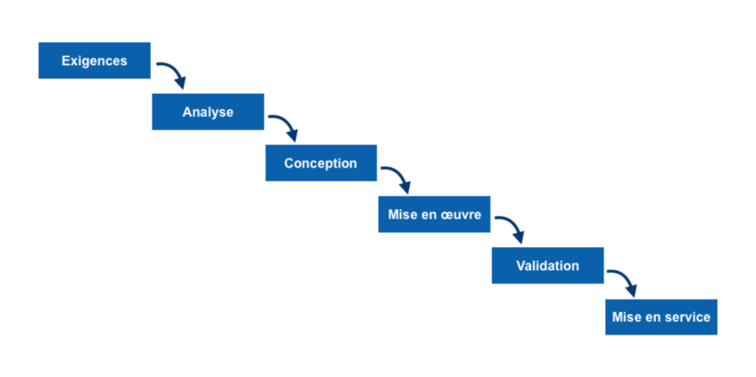
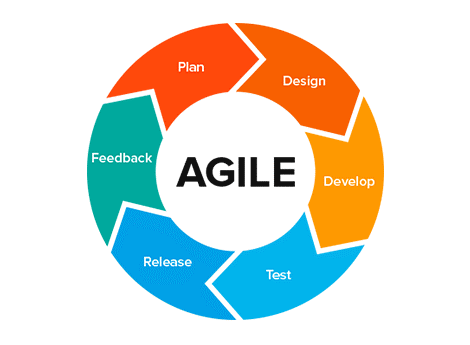
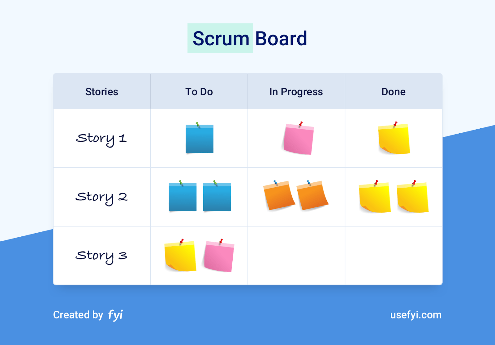
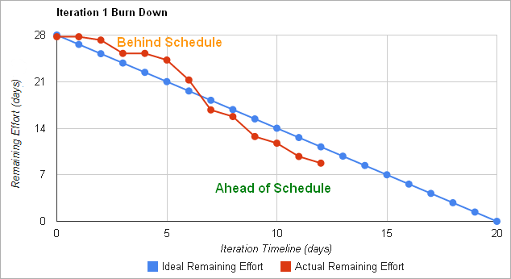
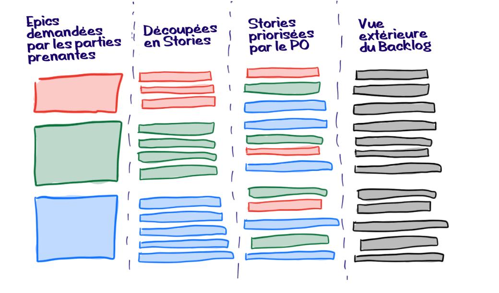
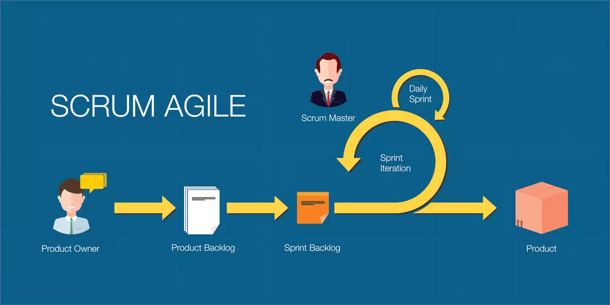

# Methodologie Agile SCRUM

## Introduction

Les méthodologies Agile sont issues du *Manifeste pour le développement agile de logiciels*[^1].   
Elles s'opposent au [modèle en cascade](https://fr.wikipedia.org/wiki/Mod%C3%A8le_en_cascade) (*waterfall*) qui se base sur des exigences exprimées en début de projet et où chaque phase ne commence qu'après avoir validé les résultats de la précédente.   
[^1]: [Wikipedia | Manifeste Agile](https://fr.wikipedia.org/wiki/Manifeste_agile);

[^2]   

### Les défaults du modèle en cascade

- Processus rigide, nécessite des exigences clairement définies;
- Pas d'implication du client au cours des différentes étapes de production;
- En cas de réévauation/insatisfaction, il faut souvent remonter au début de la chaîne, voire rédéfinir les exigences

Le modèle en cascade convient au projet clairements définis qui appellent à des technologies bien ficelées (usine, construction).

[^2]: modèle en cascade;

## Les Méthodes Agiles

### [The Manifesto for Agile Software Development](https://github.com/selim9106/tech-talks/blob/main/agile-manifesto-download-2019.pdf)

Edité en 2001, le manifeste est rédigé par 17 experts du développement logiciel dans le but d'améliorer le process, le modèle en cascade ne repondant plus, selon eux, aux exigeances des organisations en perpetuelle evolution.    
Ensemble, ces experts définissent, dans ce manifeste, des critères, issus de leurs concepts respectifs, pour définir une nouvelle façon de développer des logiciels. Ainsi, le manifeste recense les dénominateurs communs à différentes méthodes existantes et les qualifie d'« agile ». Les valeurs et principes Agile sont défendus par l'[Agile Alliance](https://www.agilealliance.org/).

> *Le développement agile, appelé aussi développement adaptatif, se caractérise donc par un style de conduite de projet itératif incrémental, centré sur l’autonomie des ressources humaines impliquées dans la spécification, la production et la validation d’une application intégrée et testée en continu.   C’est à partir de ces réalités pratiques, et non pas sur la base d’une théorie globale ou structurante, que l’agilité progresse vers les sphères les plus hautes de l’organisation et participe à la création de ce que l'on peut appeler une culture agile de l'organisation.*[^3]

[^3]: Le développement incrémental (élaboration de différentes parties du process à différents moments intégrées une fois finies) permet d'améliorer le processus de développement, ainsi que d'ajuster les exigences à l'évolution de l'environnement. Le développement itératif (stratégie de remaniement) permet d'améliorer la qualité du produit par la révision et l'amélioration de certains aspects. (Source : [Wiki Agile CESI](https://wikiagile.cesi.fr/index.php?title=Utiliser_les_d%C3%A9veloppements_incr%C3%A9mental_et_it%C3%A9ratif_ensemble))

### [Les 4 valeurs fondamentales](https://agilemanifesto.org/iso/fr/manifesto.html)

Decouvrir comment mieux développer des logiciels (par la pratique et en aidant les autres à le faire) et ainsi valoriser

- Les **individus et leurs interactions** plus que les processus et les outils;   
- Des **logiciels opérationnels** plus qu’une documentation exhaustive;   
- La **collaboration avec les clients** plus que la négociation contractuelle;   
- L’**adaptation au changement** plus que le suivi d’un plan".

### [Les 12 principes Agile](https://agilemanifesto.org/iso/fr/principles.html)

- La **satisfaction du client** constitue la **priorité principale**;
- **Accueillir les changements de besoins et les exploiter tels des avantages** pour le client;
- **Délivrer des logiciels opérationnels toutes les 2-8 semaines** (privilégier les délais courts);
- **Collaboration quotidienne** entre les développeurs et les utilisateurs/représentants;
- Travailler avec des personnes motivées, dans un environnement optimisé (matériel, soutien, confiance);
- Privilégier le dialogue en face à face pour transmettre l'information à l'équipe de développement (et au sein de celle-ci);
- Définir le logiciel opérationnel comme principale mesure d'avancement;
- Instaurer un **rythme de développement soutenable et constant**;
- **Favoriser l'excellence technique et une bonne conception**;
- **Minimiser la quantité de travail inutile**;
- les **equipes autoorganisées** promettent les meilleurs conceptions/projets;
- A **intervalles réguliers**, **réfléchir en équipe comment optimiser l'efficacité** et **s'ajuster** en fonction;

### Agile : A retenir

Toute méthode dite agile prévoit le **fractionnement des étapes de développement logiciel**, la **fixation d’objectifs à court terme** et requiert d'**ajuster, au besoin, les objectifs pour répondre aux attentes du client**. L'accent est mis sur la relation équipe-client et la collaboration/communication des membres de l'équipe.   
Flexibilité et souplesse dans l’organisation sont les deux piliers fondamentaux des méthodes agile.[^4]

[^4]: [Journal du Net: Méthode agile : définition, comparatif et avantages](https://www.journaldunet.fr/web-tech/guide-de-l-entreprise-digitale/1443838-methode-agile-definition-comparatif-et-avantages/)

### Exemples de méthodologies Agile

- [La méthode Crystal Clear](https://fr.wikipedia.org/wiki/Crystal_clear) ;
- [L'ASD (Adaptive software development)](https://fr.wikipedia.org/wiki/Adaptive_software_development) ;
- [Dynamic systems development method](https://fr.wikipedia.org/wiki/Dynamic_systems_development_method), version anglaise de la [RAD (rapid-application development)](https://fr.wikipedia.org/wiki/D%C3%A9veloppement_rapide_d%27applications) ;
- Le modèle [GROW (Goal, Reality, Obstacles, Options, Way Forward)](https://en.wikipedia.org/wiki/GROW_model) ;
- [XP (Extreme Programming)](https://fr.wikipedia.org/wiki/Extreme_programming) ;
- [FDD (Feature-driven Development)](https://fr.wikipedia.org/wiki/D%C3%A9veloppement_bas%C3%A9_sur_les_fonctionnalit%C3%A9s) ;
- [BDD (Behavior-driven Development)](https://fr.wikipedia.org/wiki/Programmation_pilot%C3%A9e_par_le_comportement) ;
- [Kanban](https://www.journaldunet.fr/web-tech/guide-de-l-entreprise-digitale/1443832-kanban/) ; 
- Le framework [Scrum](https://fr.wikipedia.org/wiki/Scrum_(d%C3%A9veloppement)) ;

## SCRUM

La méthode Scrum (en français *mêlée*), emprunte son nom au rugby, sport qui requiert une soudée avançant dans la même direction. Il s'agit de la méthodologie Agile la plus utilisée dans la gestion de projet.   
Elle est majoritairement utilisée dans le developpement d'applications web.  

### Histoire

 Ken Schwaber et Jeff Sutherland 

### Principes

La méthode SCRUM planifie des *Sprints*, soit des cycles de production courts (1 à 4 semaines) ciblés sur des fragments du produit/service. Ce fonctionnement permet de faire le point régulièrement, en équipe, sur l'état d'avancement du projet et de l'adapter aux éventuelles nouvelles exigeances.   

On peut dégager 6 principes :

- Le **contrôle du processus** empirique ;
- L'**autonomie** et l'auto-organisation de l'équipe ;
- La **collaboration** ;
- La hiérarchisation ou **priorisation basée sur la valeur** ;
- Les dates d'**échéance** ;
- Le **développement itératif**.   

Des **daily scrum meetings** permettent à l'équipe de développement de faire le point au quotidien (tâches réalisées, points de blocage, objetifs du jour) et use comme support d'un [scrum board], inspiré de la méthode Kanban.

[^5]
[^5]: [Nira | The Top 10 Scrum Boards You Should Be Using](https://nira.com/scrum-board/)

### Avantages

- Les cycles courts permettent rapidement une itération utilisable du produit ;
- Validation/contrôle du client à chaque sprint et prise en compte des évolutions (besoins, technologies) ;
- Production incrémentale

### Les piliers de SCRUM

- La **transparence** : Toutes les parties prenantes (management, équipe projet, utilisateur) ont connaissance des information nécessaires à la compréhension du projet ;
- L'**inspection** : évaluations régulières destinées à vérifier que le développement est toujours en phase avec les demandes du client ; 
- L'**adaptation** : corriger la trajectoire du projet si des écarts avec les résultats à atteindre sont détectés lors de la phase d'inspection ;

### Les 5 valeurs de Scrum (FORCE)

- La **focalisation** de l'équipe sur le développement à réaliser ;
- L'**ouverture** sur le mode de fonction de Scrum et sur la **communication interpersonnelle** pour avancer et résoudre les problèmes ensemble ;
- Le **respect** mutuel ;
- Le **courage** de l'équipe projet afin de relever les défis en toute autonomie ;
- L'**engagement** : Chacun s'engage à atteindre les objectifs de chaque sprint. 

### Scrum Master & Product Owner

#### Scrum Master
Il est coutume de nommer un **Scrum Master** (souvent le chef de projet, certifié SCRUM) afin de garantir le respect du framework.   
Le Scrum Master est chargé de planifier les **étapes de chaque sprint**, à savoir, la **plannification**, le **daily meeting**, le **sprint review** et le **sprint retrospective**.
Il identifie les points de blocage et anime les réunions destinées à trouver des solutions pour y remédier et conçoit le BDC ([burndown chart](https://fr.wikipedia.org/wiki/Burndown_chart)) qui illustre la quantité de travail restant (axe vertical) pour le temmps estimé (axe horizontal).

[^6]
[^6]: Burndown chart example (Source : [DZone | The ideal Burndown Chart](https://dzone.com/articles/the-ideal-burn-down-chart))

#### Product Owner
A côté du Scrum Master, un **Product Owner** représentera le client au sein de l'équipe projet. Il est le garant de la vision produit.
Celui-ci **reccueille les besoins des parties prenantes et les traduits en fonctionnalités** destinées à être développées par l'équipe de production.   
Pour ce faire, il rédige et alimente régulièrement un [backlog](https://hubvisory.com/blog/qu-est-qu-un-backlog-comment-le-construire-et-le-gerer/) en items appelés [*user stories*](https://hubvisory.com/blog/user-stories-comment-bien-les-rediger/)[^7] classés par ordre de priorité en fonction de quatre critères :
- la **valeur business** introduite ;
- la **connaissance nécessaire** à la réalisation (besoin de formations ?) ;
- l'**effort à produire** par l'équipe projet ;
- **les risques** (contraintes associées) pouvant générer des imprévus (prérequis, appels a des tiers ...).   

[^7]: *"Phrase simple, rédigée dans un langage courant, qui permet de décrire avec suffisamment de précision le contenu d’une fonctionnalité à développer. Dans la méthode agile Scrum dont elle est issue, la User Story est censée illustrer un besoin fonctionnel exprimé par les types d’utilisateurs."* (Source : [Hubvisory | Comment bien rédiger une User Story ?](https://hubvisory.com/blog/user-stories-comment-bien-les-rediger/))

Pour faciliter les retours des utilisateurs, Scrum conseille de mettre en place si besoin des **user tests** à l'issue de chaque sprint.

### Scrumban: une méthode hybride

Les méthodes Scrum et **Kanban** sont souvent combinées. Alors que la première vise à fractionner le processus de développement, la seconde vise à **éviter la perte de temps et d'énergie en limitant le nombre de tâches de production**.   
Contrairement à SCRUM qui vise davantage à coordonner un projet unique, **Kanban conviendra davantage à la gestion de plusieurs projets** ainsi qu'à la **TMA (tierce maintenance applicative)** et au **MCO (maintien en condition opérationnelle)**.

## Liens

- [L'histoire du Manifeste Agile](https://wikiagile.cesi.fr/pages/L'Histoire%20du%20Manifeste%20Agile.html) ;
- [Wikipedia | Limitations et extensions des méthodes agiles](https://fr.wikipedia.org/wiki/Limitations_et_extensions_des_m%C3%A9thodes_agiles) ;
- [Scrum.org](https://www.scrum.org/) ;
- [The Scrum Guide](https://scrumguides.org/scrum-guide.html) ;
- [The Scrum Guide PDF (download link)](https://scrumguides.org/docs/scrumguide/v2017/2017-Scrum-Guide-US.pdf) ;
- [Le Guide Scrum PDF (lien de téléchargement)](https://scrumguides.org/docs/scrumguide/v2017/2017-Scrum-Guide-French.pdf) ;
- [Scrum.org| Professional Scrum Certifications](https://www.scrum.org/professional-scrum-certifications) ;
- [ScrumAlliance | Scrum certifications](https://www.scrumalliance.org/get-certified) ;
- [AgilBee | Formations Agile](https://www.agilbee.com/nos-formations/) ;
- [Scrum League | Certifications SCRUM](https://scrum-league.org/) ;

## Bibliographie
- [Wikipedia | Modèle en cascade](https://fr.wikipedia.org/wiki/Mod%C3%A8le_en_cascade)
- [Wikipedia | Manifeste Agile](https://fr.wikipedia.org/wiki/Manifeste_agile)
- [Wikipedia | Méthode Agile](https://fr.wikipedia.org/wiki/M%C3%A9thode_agile)
- [Journal du Net | Scrum : C'est quoi ? Définition, guide..](https://www.journaldunet.fr/web-tech/guide-de-l-entreprise-digitale/1443834-scrum-maitriser-le-framework-star-des-methodes-agiles/)
- [Journal du Net | Sprint : du planning à la rétrospective Scrum](https://www.journaldunet.fr/web-tech/guide-de-l-entreprise-digitale/1443836-sprint-scrum/#sprint-scrum) ;
- 

