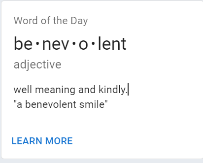

# [MUI](https://mui.com/)

## Introduction
Material UI est une librairie de composants React qui implémente les composants UI  *[Material Design](https://m3.material.io/)* de Google[^1][^2]. Ceux-ci sont donc conçus pour optimiser l'expérience utilisateur (UX) et constituent donc une référence fiable pour les designers et développeurs.   


[^1]: Source: [Material UI Overview](https://mui.com/material-ui/getting-started/overview/)
[^2]: Pour l'heure, les composants de la librairie *Material Design 3* sont destinés à Android et disposés à être utilisés avec Flutter et Jetpack Compose. Un déploiement pour le web est en cours d'élaboration. En attendant, *Material Design 2*, la version antérieure, propose des composants web (Source: [Material Web](https://m3.material.io/develop/web)).

Le principe des composants web repose sur l'encapsulement de fonctionnalités au sein d'un même élement qui peut ensuite être réutilisé sans crainte dans une interface/un projet[^3].

[^3]: Source: [Web Components |MDN Web Docs](https://developer.mozilla.org/en-US/docs/Web/Web_Components)

## Stying components

Il est possible de styliser des composants de différentes manières, chacune ayant leurs avantages et leurs inconvénients.

Il est fréquent de créer une feuille de style css par composant. Généralement, celle-ci portera le même nom que le composant dans lequel elle est importée.

```css
/*component.css*/

.component-class{
    width:100%;
    margin: 0 auto;
    color: white;
}
.component-text {
    font-size:12px;
}
```
```jsx
//Component.jsx

import "./component.css";

const Component = () => {
    return (
        <div className="component-class">
            <p className="component-text">Some text for the example</p>
        </div>
    )
}

export default Component
```

### The *inline* approach

Il est de modifier l'apparence d'un composant en faisant appel à la propriété ***style***.

*Exemple: Nous voulons alerter subtilement l'utilisateur qu'il a omis de remplir le champ "input" lors de l'ajout d'un intem à la liste en changeant la couleur du label et de l'input*

         

```jsx
// TextInput.jsx
import React, { useState } from 'react';
import Button from './Button';
// CSS Import
import './TextInput.css';

const TextInput = props => {
  const [enteredValue, setEnteredValue] = useState('');
// This state will be used as conditional expression
  const [validInput, setValidInput] = useState(true);

  const InputChangeHandler = event => {
// Reset initial color states.
    if (event.target.value.trim().length>0) {
        setValidInput(true);
    }
    setEnteredValue(event.target.value);
  };

// When form got submitted, we'll check if user entered something in the input before adding it to the list
  const formSubmitHandler = event => {
    event.preventDefault();
    if (enteredValue.trim().length === 0) {
      setValidInput(false);
      return;
  }
    props.onAddItem(enteredValue);
  };

  return (
    <form onSubmit={formSubmitHandler}>
      <div className="form-control">
        <label style={{ color: !validInput ? "red": "inherit" }}>Items List</label>
        <input type="text" style={{ borderColor: !validInput ? "red" : "inherit", backgroundColor: !validInput ? "#FFE4E1" : "inherit"}} onChange={InputChangeHandler} />
      </div>
      <Button type="submit">Add Item to list</Button>
    </form>
  );
};

export default TextInput;

```

***Note :*** La proprété *style* appelle un objet, d'où l'usage des *"double brackets"*   

### Set CSS classes dynamically

Bien que théoriquement, il est possible de travailler de la façon abordée au point précédent, cette méthode est peu utilisée, et un développeur aura tendance à n'user que des styles définis dans le fichier CSS associé, sans faire appel à la propriété *style*.  

Heureusement, il est possible de définir des classes dans le fichiers CSS qui ne seront appelées que lorsque les conditions invoquées seront remplies, de la même manière que lorsqu'on utilise un *if (condition) [element.classList.[add/remove/toggle]](https://developer.mozilla.org/en-US/docs/Web/API/Element/classList)* en Vanilla Javascript, à la différence qu'on utilisera les hooks (principalement le *useState*) pour faire passer la condition en React.   

```css   
/*add invalid conditional class that will update the input and the label*/

.form-control.invalid input {
  border-color:red;
  background: #FFE4E1;
}
.form-control.invalid label {
  color:red;
}
```
   

```jsx
// TextInput.jsx

//... same imports as code above...
import './TextInput.css';

const TextInput = props => {
  const [enteredValue, setEnteredValue] = useState('');
  const [validInput, setValidInput] = useState(true);

//...see jsx component code above ...

  return (
    <form onSubmit={formSubmitHandler}>
    {/* using template literals you can call javascript conditional code to add the 'invalid' class when user submit an empty/invalid form*/}
      <div className={`form-control ${!validInput? "invalid" :""}`}>
        <label >Items List</label>
        <input type="text" onChange={InputChangeHandler} />
      </div>
      <Button type="submit">Add Item to list</Button>
    </form>
  );
};

export default TextInput;
```

### CSS modules approach[^4]

[^4]: [Adding a CSS Modules Stylesheet](https://create-react-app.dev/docs/adding-a-css-modules-stylesheet/)

De la même manière que les modules en Javascript, il est possible d'importer un fichier CSS en tant que *module*. 
Très similaire à l'approche *pure CSS*, **les modules vont permettre l'encapsulement (*scoping*) en générant un nom de classe unique**.   

Les projets react créées avec *create-react-app* ou *[Vite](https://vitejs.dev/guide/)* intègrent déjà l'usage des CSS modules, par conséquent, aucune configuration/istallation n'est requise.   
Seule la syntaxe change quelque peu. Les fichiers css devront par ailleurs être renommés *'stylesheetname.module.css'* et être importés *'as' styles* (nom de variable arbitraire).   

```css
.button {
  width:100%;
  /*...*/
}

/* To use media-queries with CSS modules */

@media (min-width:768px) {
  .button {
    width:auto;
  }
}
```
```jsx
// Button.jsx:

import styles from './Button.module.css'; // you can use any variable name to import your css module

const Button = props => {
  return (
    // use the curly brackets and the module name before calling your style
    <button type={props.type} className={styles.button} onClick={props.onClick}>
      {props.children}
    </button>
  );
};
// /!\ use square brackets + quotes to call classNames containing hyphens: style={styles["button-class"]}

export default Button;
```
Les classes sont appelées telles des propriétés dans l'objet *styles* ({styles.button}) et le building génère un identifiant unique pour chaque appel de la classe, garantissant ainsi l'encapsulement.

   
   


Styles dynamiques et CSS modules:
```jsx
// TextInput.jsx

//... same imports as code above, except css stylesheet
import './TextInput.module.css';

const TextInput = props => {

//...see jsx component code above ...

  return (
    <form onSubmit={formSubmitHandler}>
    {/*Similar synthax as above, except you have to mention the module name each time you add a class*/}
      <div className={`${styles["form-control"]} ${!validInput &&  styles.invalid}`}>
        <label >Items List</label>
        <input type="text" onChange={InputChangeHandler} />
      </div>
      <Button type="submit">Add Item to list</Button>
    </form>
  );
};

export default TextInput;
```
L'inconvénient de cette méthode réside dans sa syntaxe contraignante *${styles.class}*. Des développeurs ont néanmoins conçu des solutions (simples fonctions ou [packages](https://github.com/JedWatson/classnames)), comme évoqué sur [ce thread](https://stackoverflow.com/questions/33949469/using-css-modules-how-do-i-define-more-than-one-style-name)[^4].
[^4]: ["using css modules how do I define more than one style name" | Stackoverflow](https://stackoverflow.com/questions/33949469/using-css-modules-how-do-i-define-more-than-one-style-name)

### Styles Component approach
Lorsqu'on parle de librairies de composants, on pense d'abord à *[Styled Components](https://www.makeuseof.com/styled-components-react-pros-cons/)* dont l'usage est répandu chez les développeurs qui utilisent React. *Styled Components* permet de créer de *custom components* en définissant le style du composant directement dans le fichier js/jsx concerné.   

[Installation](https://styled-components.com/docs/basics#installation):

```
# with npm
npm install --save styled-components

# with yarn
yarn add styled-components
```

Usage:

```jsx
// TextInput.jsx:
//...
import styled from 'styled-components',

const FormControl = styled.div`
margin: 0.5rem 0;

& label {
  font-weight: bold;
  display: block;
  margin-bottom: 0.5rem;
}

& input {
  //...
}
&.invalid label {
  //...
}
&.invalid input {
  //... 
}
//add media query inside components:
@media-query(max-width:1200px) {
  margin: 2rem;
}
`;

const TextInput = props => {
  const [enteredValue, setEnteredValue] = useState('');
  const [validInput, setValidInput] = useState(true);

  //...

  return (
    <form onSubmit={formSubmitHandler}>
    {/* <div className="form-control">
        <label>Items List: </label>
        <input type="text"/>
      </div> */}

    {/*We can replace the wrapper div with the FormControl styled component created above and add the invalid class if the condition is checked*/}
      <FormControl className={!validInput && "invalid"}>
        <label>Items List: </label>
        <input type="text"/>
      </FormControl>
      <Button type="submit" onChange={InputChangeHandler}>Add Item to list</Button>
    </form>
    
  );
};

export default TextInput;
```
Comme pour les CSS modules, ce procédé va générer un nom de classe unique après le building.   

Il est également possible d'ajouter des propriétés au composant et de les appeler 

```jsx
// TextInput.jsx:
//...
import styled from 'styled-components',

const FormControl = styled.div`
margin: 0.5rem 0;

& label {
  font-weight: bold;
  display: block;
  margin-bottom: 0.5rem;
  color: ${props => props.invalid ? 'red': 'inherit'};
}

& input {
  //...
  border: 1px solid ${props => props.invalid ? 'red': 'inherit'};
  background: ${props => props.invalid ? '#FFE4E1': 'transparent'};
}
`;
// We removed the '.invalid' class as we now pass the invalid (which takes the 'validInput' parameter) condition as prop.

const TextInput = props => {

  //...

  return (
    <form onSubmit={formSubmitHandler}>
  {/*We add an invalid prop that use the validInput state*/}
      <FormControl invalid={!validInput}>
        <label>Items List: </label>
        <input type="text"/>
      </FormControl>
      <Button type="submit" onChange={InputChangeHandler}>Add Item to list</Button>
    </form>
    
  );
};

export default TextInput;
```

## MUI
La documentation propose différentes librairies de comoposants dont la syntaxe et l'usage sont similaires.

- [Material UI](https://mui.com/material-ui/getting-started/overview/): elle permet l'implémentation de composants UI Basée sur la librairie *[Material Design v2](https://m2.material.io/)* de Google
- [MUI Base](https://mui.com/base/getting-started/overview/) permet plus de liberté en proposant des composants non stylisés et dispense ainsi donc d'*overrider* des styles par défaut. La librairie est pour l'instant disponible en version alpha.
- [Joy UI](https://mui.com/joy-ui/getting-started/overview/) : une librairie open-source de composants React developpées par MUI qui implémente ses propres [standards](https://mui.com/joy-ui/getting-started/overview/#principles).
- [MUI System](https://mui.com/system/getting-started/overview/) reprend des composants structurels (*Box*, *Container*, ...) customisables via la propriété `sx` (voir ci-dessous). Elle fonctionne de paire avec *Material UI* ou *MUI Base* et est incluse dans leur installation.


Pour chacune des librairies, la documentation recense l'ensembles des composants, leur usage, leur apparence (selon leur états), leurs propriétés (dans l'onglet *component API*) et propose des exemples.  

### [Installation](https://mui.com/material-ui/getting-started/installation/)
Par défaut, MUI utilise la librairie *[emotion](https://emotion.sh/docs/introduction)* pour générer les styles CSS dans Javascript. Toutefois, il est possible de configurer une installation avec *styled-components*

#### Avec *emotion*:
```
npm install @mui/material @emotion/react @emotion/styled
```
#### Avec *styled-components*:
```
npm install @mui/material @mui/styled-engine-sc styled-components
```
Par défaut, MUI utilise la font *Roboto*, il est recommandé de l'installer (manuellement ou via le CDN de *Google Fonts*).
```
npm install @fontsource/roboto
```
```html
<link rel="stylesheet" href="https://fonts.googleapis.com/css?family=Roboto:300,400,500,700&display=swap"/>
```
De la même manière les icones utilisés par MUI nécessitent l'installation (manuelle ou CDN) de la font *[Material Icons](https://fonts.google.com/icons?icon.set=Material+Icons)*.
```
npm install @mui/icons-material
```
***Note:*** *l'installation avec Vite peut entraîner certains conflits*

```html
<link rel="stylesheet" href="https://fonts.googleapis.com/icon?family=Material+Icons"/>
```
Il est recommandé d'insérer le composant ***[CSS Baseline](https://mui.com/material-ui/react-css-baseline/)***, qui fait office de *reset/normalize.css*.

### Usage

Chaque composant possède des propriétés standards qui peuvent prendre certaines valeurs afin d'en modifier le rendu.

```jsx
// import Material UI Card component
import Card from '@mui/material/Card';
// or import multple material components
import { Box, Card, CardActions, CardContent, Button, Typography } from '@mui/material';

const card = (
  <React.Fragment>
    <CardContent>
      <Typography sx={{ fontSize: 14 }} color="text.secondary" gutterBottom>
        Date
      </Typography>
      <Typography variant="h5" component="div">
        Card Component
      </Typography>
      <Typography variant="body2">
        Card description
      </Typography>
    </CardContent>
    <CardActions>
      <Button size="small">Learn More</Button>
    </CardActions>
  </React.Fragment>
);

export default function OutlinedCard() {
  return (
    <Box sx={{ minWidth: 275 }}>
      <Card variant="outlined">{card}</Card>
    </Box>
  );
}
```

the OutlinedCard component will rendr like this:



### Customize Components
#### Les thèmes
MUI utilise un [thème par défaut](https://mui.com/material-ui/customization/default-theme/) qui comporte une série de propriétés définies selon les composants de Material UI (ou Joy UI selon la configuration).   
Il est néanmoins possible d'*updater* certaines valeurs pour personnaliser son application. Celles-ci peuvent être testées sur le [Material-UI Theme Creator](https://bareynol.github.io/mui-theme-creator/). 

Pour customiser le thème par défaut, il est nécessaire d'importer le composent *ThemeProvider* et d'encapsuler le composant ou l'application ciblée.

```jsx
import { red } from '@mui/material/colors';
import { ThemeProvider, createTheme } from '@mui/material/styles';

const theme = createTheme({
  palette: {
    mode: dark,
    primary: {
      main: red[500],
    },
  },
});

function App() {
  return (
    <ThemeProvider theme={theme}>
      <CssBaseline />
      <main>
      This app is using the dark mode
      </main>
    </ThemeProvider>
      );
}
```


#### La propriété `sx`
Comme évoqué ci-dessus, [la propriété sx](https://mui.com/system/getting-started/the-sx-prop/)  permet d'inclure des propriétés CSS aux composants *Box*, *Container*, *Grid*, ... 


```jsx
const BoxComponent = () => {
  return (
    <Box>
    <Box sx={{
        display: 'flex',
        flexDirection: { xs: 'column', md: 'row' },
        alignItems: 'center',
        color: 'text.secondary',
        display: 'inline',
        fontSize: 12
    }}>
    boxcontent
    </Box>
    <Box
        component="img"
        sx={{
          height: 233,
          width: 350,
          maxHeight: { xs: 233, md: 167 },
          maxWidth: { xs: 350, md: 250 },
        }}
        alt="The house from the offer."
        src="https://images.unsplash.com/photo-1512917774080-9991f1c4c750?auto=format&w=350&dpr=2"
      />
    </Box>
  )
}
```


### 

## Other components libraries
Bien qu'il soit possible d'actualiser le style d'un composant de façon "classique", cette méthode ne permet pas l'encapsulement et par conséquent le style attribué est susceptible de toucher d'autres éléments de l'interface.

# Links
- [LEARN MUI (official doc free videos)](https://mui.com/material-ui/getting-started/learn/)
- [Material Design | Github](https://github.com/material-components)
- [Material Design 2](https://m2.material.io/)
- [Material Design 3](https://m3.material.io/)
- ["Introductiong the M3 design kit for Figma" | Material Design Blog](https://material.io/blog/material-3-figma-design-kit)   
- ["Adding a sass stylesheet" | Create React App](https://create-react-app.dev/docs/adding-a-sass-stylesheet/)   
- [Styled Components | Github](https://github.com/styled-components/styled-components)
- [Awesome Styed Components | Github](https://github.com/styled-components/awesome-styled-components)
- [*"Mieux gérer CSS dans les gros projets grâce aux CSS modules."* | Jérôme Boukorras](https://medium.com/just-tech-it-now/mieux-g%C3%A9rer-css-dans-les-gros-projets-gr%C3%A2ce-aux-css-modules-662b9cf84000)
- [Material Icons | Google Fonts](https://fonts.google.com/icons?icon.set=Material+Icons)

# Bibliography
- ["How to use styled components with Material UI in a React app" (Benjamin Stirrup) | Sipios](https://www.sipios.com/blog-tech/how-to-use-styled-components-with-material-ui-in-a-react-app)

