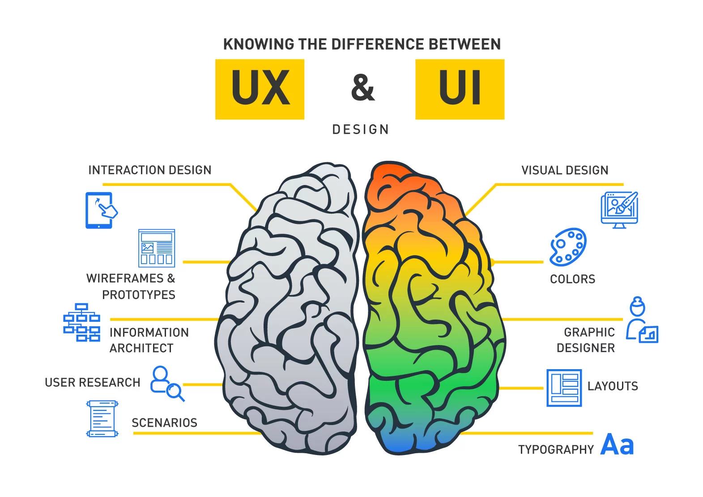

# UX Research
## UX vs UI
Souvent associés l'experience utilisateur (UX ou *User Experience*) et l'interface utilisateur (UI ou *User Interface*) constituent le socle qui définit l'interaction de l'utilisateur avec le produit créé. On peut considérer que le volet *UX* est un processus en amont qui, sur base d'analyses de données préalablement collectées, fait coïncider l'*UI* avec les attentes de l'usager.   

[^1]   

L'UI Designer se focalise sur l'apparence du produit en accordant la priorité à l'aspect fonctionnel et à l'ergonomie. Ainsi, c'est lui qui définit la charte graphique (couleurs, typographies,...) et l'emplacement des éléments. Il doit garder à l'esprit les objectifs définis lors de la phase de conception. Les deux aspects se complètent pour satisfaire l'utilisateur final du produit.

[^1]: [IMAGINXP: A Pilot to the Difference between UI and UX](https://imaginxp.com/a-pilot-to-the-difference-between-ui-and-ux/)

L'UX/UI constitue un domaine largement exploité depuis l'avènement des smartphones qui dominent la navigation.   

*Note: l'UX/UI ne concerne pas que les produits numériques.*   

[^2]

[^2]: [ux vs. ui design : la bouteille de ketchup qui sème la confusion](https://www.farouknasri.com/ux-vs-ui-design-bouteille-ketchup-confusion-prejuge/)

### Les métiers

Généralement associé au métiers de (web)designer, le processus *UX/UI* peut impliquer de nombreux acteurs, notamment dans les grandes entreprises. Cependant, tous collaborent dans un même but: optimiser répondre aux besoins de l'utilisateur.   

#### Interaction designers
Il se focalise sur l'interaction de l'utilisateur avec le produit et sur les features à y implémenter pour l'optimiser.   
*Exemple: quel action engendre un bouton*

#### Visual designers
Ils se consacrent à l'apparence du produit (couleurs, logo, image, boutons, animations...) et à la création de visuels équivoques et accessibles (icones,...) tout en respectant la charte graphique et l'image de marque de l'entreprise.   
Le visuel doit inciter l'utilisateur à poursuivre son expérience et idéalement à la conversion.

#### Motion Designer

Il pousse la réflexion sur l'interaction et optimise l'interface en imaginant des transitions fluides et efficaces entre les actions et pages.   
Les motion designers, généralement, réalisent des vidéos explicatives qui facilitent la compréhension de l'utilisateur.   
   
*Note: il existe aujourde des VR/AR designers qui déploient des expériences immersives*

#### UX Researcher
Ils travaillent en amont, dirigent des études, réalisent des enquêtes et organisent des interviews afin de récolter des données sur les experiences des utilisateurs

## Le cycle de développement du produit

5 stades:
- Brainstorm
- Define
- Design
- Test
- Launch

## UX Research

L'UX Research consiste à identifier les principaux *pain points* rencontrés par les utilisateurs (dans leur vie quotidienne ou dans l'utilisation d'un produit/service) et à réfléchir à la façon d'y remédier.

Il est important de se confronter directement aux utilisateurs pour éviter les *bias*, c'est à dire les suppositions,... qui biaisent le processus de conception. Toujours retenir que notre expérience avec un produit (surtout en tant qu'UX/UI designer), n'est pas représentative de celle du public cible.   
Il est important de multiplier les interviews, recherches et collecter un maximum de data.

## Cibler une problématique
Sur base d'une problématique, on définit des objectifs qui deviendront la ligne de conduite du processus.   
Ainsi, si le principal problème rencontré par les utilisateurs est le timing, une possibilité de suivre/tracker en temps réel.

equitable/equisitive
### Outils

#### Interviews
build empathy, dont make assumptuions
#### Personas
#### User stories
#### User Journey maps

# Bibliographie
- [UX et UI design, les deux faces de l’interface utilisateur](https://www.use.design/ux-ui-avec-use-design-agence-designer-paris/?gclid=Cj0KCQiAg_KbBhDLARIsANx7wAyAB5geq_fnKziLHGaPqV41Qt0kQdh6WF1y2WTiBUTB8e0y7OedfQEaAk9JEALw_wcB)
- [L’UX designer et l’UI designer
](https://www.use.design/ux-designer-ui-designer/)